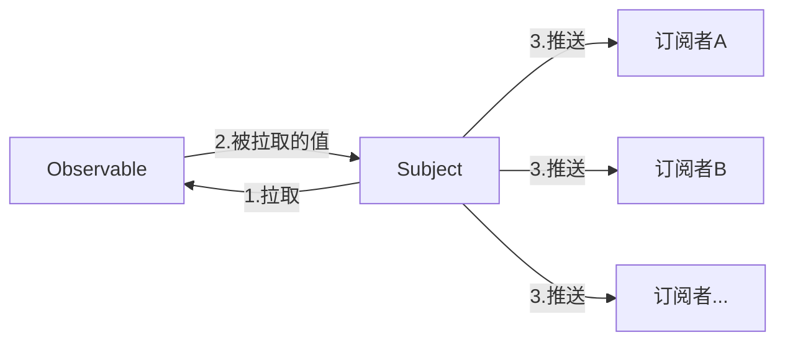

## 可观察对象（Observable）的基本用法

> rxjs在Angular的项目中基本替代了promise，一直以来对Observable和Subject的概念和用法都有点傻傻分不清楚，准备来捋一捋

### 观察者（Observer）

这里的观察者也就是观察者模式，**声明式的**，也就是说当有人订阅他的时候才会去执行，可以理解为送报纸，没定怎么可能给你送过来，当你订阅了之后，才会去执行生产报纸，再送报纸（执行被订阅函数）这个过程。

同样，我们也不需要去关心报纸是怎么生产的，是怎么运送到我们手中的，我们只需要等他送过来拿来看就行了（得到订阅的值，直接拿来用就行了）

当然我们也可以随时取消订阅，订报纸也是一样

### 基本用法

首先得有个可观察对象，也就是得有个报纸厂才行

```javascript
const paperFactory = new Observable();
```

接下来我们就订阅这个对象，也就是定报纸了

```javascript
const paperFactory = new Observable();
paperFactory.subscribe();
```

等等，光有个报纸厂还不行，我们肯定是要生产报纸的

```javascript
// observer 可以理解送报员吧
// process 这个函数就是一整套生产配送流程了
const process = (observer) => {
	try {
		// 。。。 这里执行了一系列的函数
		// 。。。 也就是执行了一系列的工艺
		const paper = '这是一份报纸'
		observer.next(paper);
	} catch (e) {
		observer.error('生产过程出了些问题')
	}

	return {
		unsubscribe() {
			console.log('我要取消订阅！');
		}
	}
}
```

- 上面的`observer.next(paper)`也就是将报纸送达客户手中的这个过程了，订阅者得到的就是这个paper
- 返回的是一个取消订阅函数，可以订阅当然也必须可以取消

| 通知类型 | 说明                                                         |
| -------- | ------------------------------------------------------------ |
| next     | 必要。用来处理每个送达值。在开始执行后可能执行零次或多次。   |
| error    | 可选。用来处理错误通知。错误会中断这个可观察对象实例的执行过程。 |
| complete | 可选。用来处理执行完毕（complete）通知。当执行完毕后，这些值就会继续传给下一个处理器。 |

#### 订阅

```javascript
const process = ()=>{}; // 具体代码在上面
const paperFactory = new Observable(process);
paperFactory.subscribe();
```

现在报纸生产好了，我们需要去订阅他了

⚠️注意这个说法可能有些错误，只是为了方便理解，因为在文章的开头说了，当有订阅时，被订阅函数才会实际去执行，换句话说，当我们**先**定了报纸后，厂家才会**后**去生产报纸，送到我们手上。

```javascript
const process = () => { }; // 具体代码在上面
const paperFactory = new Observable(process);
const readPaper = (paper) => { console.log('这份报纸的内容是:' + paper) }
paperFactory.subscribe(readPaper);
```

`readPaper`也可以是一个对象，分别包含三种情况的处理方式，当然不需要全部写出来

```javascript
const readPaper = {
  next(paper){},
  error(e){},
  complete(){}
};
```

同时，也可以分别传入参数

```javascript
const nextFn = () => {};
const errFn = () => {};
const completeFn = () => {};
paperFactory.subscribe(nextFn,errFn,completeFn);
```

## 多播

假如出现了第二个订阅者，如果还是以前面的方式进行发布，那么就会出现这种现象，订阅者订阅一次，被订阅函数就执行一次（每个订阅者得到的对象都是相互独立的，这在有些时候可以这样做），换成前面的例子，也就是说只要出现一个定报纸的人，那工厂马上就要印一份送到用户手中，那工厂还干不干？

```javascript
let count = 1
// 这里把process稍做修改
const process = (observer) => {
		const paper = '这是一份报纸'
		observer.next(paper);
  	// 内部增加一行count++其他不变
  	count++;
}

paperFactory.subscribe(paper => console.log(count + paper));
// 过了0.5秒再触发
setTimeout(() => {
  paperFactory.subscribe(paper => console.log(count + paper));
}, 500);

// Logs:
// （立即打印）：1 这是一份报纸
// （0.5秒后打印）：2 这是一份报纸
```

以上，说明process每次都会被运行

所以不妨尝试换一个思路，我报纸厂就每天早中晚定时生产3批，无论何时订阅，都不会立即生产，都在下一个批次的时候收到报纸

⚠️当然这里有个bug，就是订阅后接下来的每一批生产出来的都会被订阅者收到，暂且理解为当天每个不同时间段发生的新闻吧，报纸内容会有所不同，所以当然后面的每一批都要发给订阅者

```javascript
import { Observable } from "rxjs";
function sequenceProcess() {
  const batch = ["早", "中", "晚"];
  const customers = [];
	let count = 0;
  
  return (customer) => {
    customers.push(customer);
    // 收到一个订阅的时候开始生产
    if (customers.length === 1) {
      setInterval(() => {
        customers.forEach((_customer) => {
          _customer.next(batch[count]);
        });
        count++;
      }, 1000);
    }
  };
}

// 订阅
const paperFactory = new Observable(sequenceProcess());
paperFactory.subscribe((paper) => console.log("第一个用户：", paper));
setTimeout(() => {
  paperFactory.subscribe((paper) => console.log("第二个用户：", paper));
}, 1500);

// Logs:
// 开始：第一个用户：早
// 第二秒：第一个用户：中
// 第二秒：第二个用户：中
// 第三秒：第一个用户：晚
// 第三秒：第二个用户：晚
```

⚠️上面的代码为了更直观的体现多播的核心思想，缺少了取消监听和取消计时器等其他细节

### Observable和Subject的区别

回到最开始的问题，实际上就是上面提到的多播，是rxjs库提供的一套处理多播的逻辑，具体使用方式参考[rxjs文档](https://cn.rx.js.org/)

这里再补充一个`BehaviorSubject`，平时开发中用得最多的就这三个，用前面的例子来讲和`Subject`的区别就是，在订阅后`Subject`获得的是下一批次的报纸，而`BehaviorSubject`在等待后面批次的同时，**能立即获得最近一批已经生产好了的报纸**，换句话说也就是`BehaviorSubject`**能立即获得当前的值**


2020.1.8更新

----

### 重新定义Observable和Subject

在深入看了rxjs文档之后，发现实际上他们并不是一个平级的关系，Subject实际上一种特殊的Observable，虽然这不影响上面例子的使用，但概念层面的还是弄清楚些为好。

他们之间真正的区别实际上在与一**推**一**拉**，什么是推和拉

|          | 生产者                             | 消费者                             |
| -------- | ---------------------------------- | ---------------------------------- |
| **拉取** | **被动的:** 当被请求时产生数据。   | **主动的:** 决定何时请求数据。     |
| **推送** | **主动的:** 按自己的节奏产生数据。 | **被动的:** 对收到的数据做出反应。 |

**什么是拉取？** - 在拉取体系中，由消费者来决定何时从生产者那里接收数据。生产者本身不知道数据是何时交付到消费者手中的。

**什么是推送？** - 在推送体系中，由生产者来决定何时把数据发送给消费者。消费者本身不知道何时会接收到数据。

#### Observable

也就是说Observable是一个拉取的操作

```javascript
var foo = Rx.Observable.create(function (observer) {
  console.log('Hello');
  observer.next(42);
});

foo.subscribe(function (x) {
  console.log(x);
});

//输出
//"Hello"
//42

```

在订阅者没有`subscribe`之前，是无法获取到生产者内部的值，而这里的`subscribe`恰恰就是**拉**的过程

#### Subject

Subject是一个推送的操作

```javascript
var subject = new Rx.Subject();

subject.subscribe({
  next: (v) => console.log('observerA: ' + v)
});
subject.subscribe({
  next: (v) => console.log('observerB: ' + v)
});
```

如果现在没有其他多余的代码，那么这段代码将没有任何输出结果，因为对与Subject而言这里的`subscribe`已经不在是拉取，而是**注册**，所以这正是Subject可以处理多播的原因。

```javascript
var subject = new Rx.Subject();

subject.subscribe({
  next: (v) => console.log('observerA: ' + v)
});
subject.subscribe({
  next: (v) => console.log('observerB: ' + v)
});

subject.next(1);
subject.next(2);

//输出
//observerA: 1
//observerB: 1
//observerA: 2
//observerB: 2
```

`subject.next()`正是上面提到的**推**的这一过程，它会向所有注册过的消费者都推送该值过去。

### Subject是一种特殊的Observable 

之所以会这么说，是因为Subject同样可以作为消费者去拉取Observable中的值

```javascript
var subject = new Rx.Subject();

subject.subscribe({
  next: (v) => console.log('observerA: ' + v)
});
subject.subscribe({
  next: (v) => console.log('observerB: ' + v)
});

var observable = Rx.Observable.from([1, 2, 3]);

observable.subscribe(subject); 

//输出
//observerA: 1
//observerB: 1
//observerA: 2
//observerB: 2
//observerA: 3
//observerB: 3
```

通过下面的流程图可以更加清晰的理解上面代码所实现的内容



### Observable不一定是异步的

这是很容易搞混的一点，包括我自己，最开始的时候同样认为Observable是异步的，它和Promise类似，实际上当我们new一个promise的时候，promise内部首先会同步的执行一遍，Observable同样也是如此

```javascript
var observable = Rx.Observable.create(function (observer) {
  observer.next(1);
  observer.next(2);
  observer.next(3);
  setTimeout(() => {
    observer.next(4);
    observer.complete();
  }, 1000);
});

console.log('just before subscribe');
observable.subscribe({
  next: x => console.log('got value ' + x),
  error: err => console.error('something wrong occurred: ' + err),
  complete: () => console.log('done'),
});
console.log('just after subscribe');

```

如果按照Observable是异步的去理解，那么输出的结果一定是

```javascript
// just before subscribe
// just after subscribe
// 。。。
```

但是实际结果是

```javascript
// just before subscribe
// got value 1
// got value 2
// got value 3
// just after subscribe
// got value 4
// done
```

很显然，Observable只是**可以做异步的事，但不一定是异步的**

